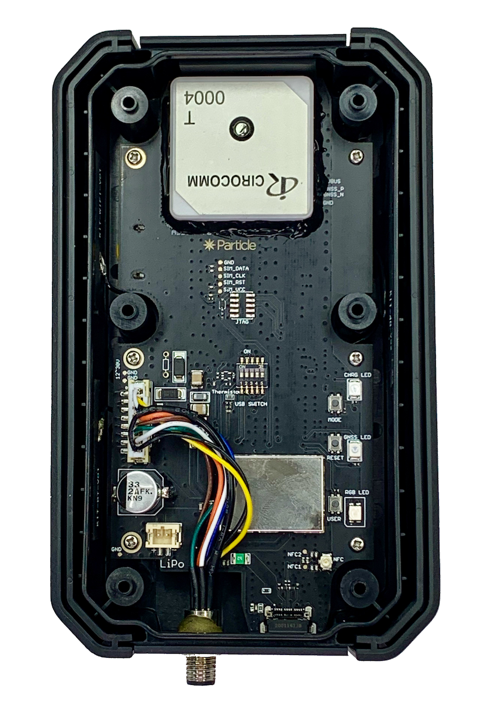

# Tracker Hardware Resources

*Hardware repository for the Tracker SoM evaluation board and carrier board (Tracker One)*

Datasheets:

- [Tracker SoM](https://docs.particle.io/datasheets/asset-tracking/tracker-som-datasheet/)
- [Tracker SoM Evaluation Board](https://docs.particle.io/datasheets/asset-tracking/tracker-som-eval-board/)
- [Tracker One](https://docs.particle.io/datasheets/asset-tracking/tracker-one/)

In this repository you can find the following directories:

- eagle-eval: The Tracker SoM evaluation board
- eagle-carrier: The Tracker carrier board (the board in the Tracker One)

Within the Eagle directories are the standard Eagle files:

- *.sch Schematic file
- *.sch.pdf PDF version of the schematic (handy if you don't have Eagle CAD)
- *.brd Board Layout file
- *.lbr Library containing all of the components in the sch/brd files
- *.rar or *.zip Gerber files
- *.cam CAM file used to produce the Gerber file

The boards are identical for both Tracker SoM versions (T402 and T523).

Other useful resources include:

- [Creating your first Tracker SoM board tutorial](https://docs.particle.io/tutorials/asset-tracking/tracker-som-first-board/).

## Version History

### Tracker One (Carrier Board) v1.1 (2020-08-18)

1. Added TS3A5018 analog switch for isolate M8 IO pins.
2. Recalculated impedance, modified RF 50 ohm and USB 90 ohm trace width.
3. Added CAN BUS 5V output bypass fuse F2.
